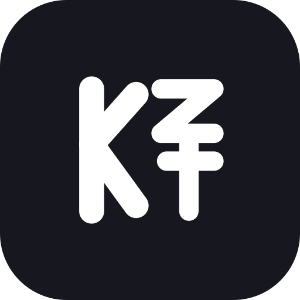
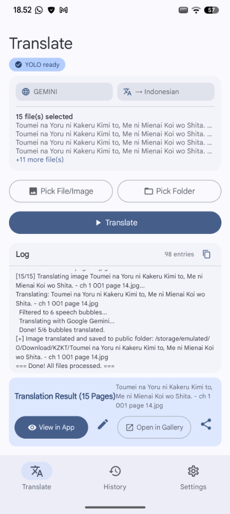
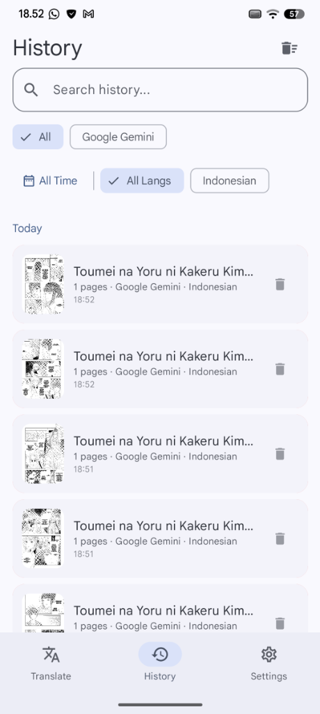

<div align="center">
  
  <h1>KZKT</h1>

  <p>
    <a href="LICENSE"></a>
    <a href="https://github.com/kouzen-neo/kzkt/releases"></a>
    <a href="https://developer.android.com"></a>
    <a href="https://ai.google.dev/edge/litert"></a>
    <a href="https://opencv.org/"></a>
  </p>

  <p>
    <a href="README.md"></a>
    <a href="README.id.md"></a>
  </p>
</div>

KZKT is a native Android application for automatic manga and comic translation. It detects speech bubbles on-page using on-device AI, translates text using your preferred LLM provider (or 100% offline via LiteRT on-device GPU models), erases original Japanese/Korean/Chinese text strokes, and renders natural, styled translations directly onto the page.

<div align="center">
  <table>
    <tr>
      <td align="center" width="33%"><b>Translate Screen</b></td>
      <td align="center" width="33%"><b>History Screen</b></td>
      <td align="center" width="33%"><b>Settings Screen</b></td>
    </tr>
    <tr>
      <td align="center" width="33%"></td>
      <td align="center" width="33%"></td>
      <td align="center" width="33%"></td>
    </tr>
  </table>
</div>

---

## Highlights & Features

- **Wide Input Formats**: Translate single images, whole folders, multi-image selections, archives (ZIP / CBZ / EPUB), and PDF documents — with **PDF in → translated PDF out**.
- **100% Offline On-Device AI (Google LiteRT)**: Translate without internet or API keys using native Qualcomm Adreno OpenCL GPU acceleration (Gemma 4, Qwen 3, Gemma 3).
- **Multi-Cloud LLM Support**: Google Gemini, Anthropic (Claude), OpenAI (GPT), OpenRouter, Zen, OpenCode Go, or any custom OpenAI-compatible endpoint (Ollama, LM Studio, LocalAI, vLLM).
- **On-Device YOLO Speech Bubble Detection**: 3-stage ONNX cascade detects dialogue bubbles locally without sending images to external servers.
- **Multi-Script Local OCR**: ML Kit text recognition for Japanese, Latin, Korean, and Chinese with free-text region detection.
- **Intelligent Typography & Inpainting**: Multi-core lock-free OpenCV inpainting with diamond-shaped elliptical text wrapping, optical vertical centering, and syllable hyphenation.
- **In-App Reader & Touch-up Editor**: View translated results in single-page or continuous webtoon mode, and tap any bubble to edit text directly.
- **Instant PDF Reader**: Lazy-loaded page-by-page rendering for large translated PDF documents.
- **Glossary & Translation Memory**: Custom terminology dictionary to enforce character names and recurring terms.
- **Background Worker & Auto-Updater**: Translations continue in the background via WorkManager, with built-in auto-update checking for new GitHub releases.

---

## Download & Installation

Grab the latest APK directly from **[GitHub Releases](https://github.com/kouzen-neo/kzkt/releases/latest)**.

### Which APK should I download?

| APK Variant | Recommended Device |
|---|---|
| **`KZKT-arm64-v8a-*.apk`** | **Recommended for modern phones** (Snapdragon, Dimensity, Tensor, Exynos 64-bit). Smallest file size (~125 MB). |
| **`KZKT-armeabi-v7a-*.apk`** | Older 32-bit Android phones. |
| **`KZKT-x86_64-*.apk`** | 64-bit Android emulators (LDPlayer, BlueStacks, Waydroid) / ChromeOS. |
| **`KZKT-universal-*.apk`** | Compatible with all Android devices (larger file size). |

---

## Translation Pipeline

```text
[ Input image / manga page / PDF ]
           │
           ▼
[ 1. YOLO Bubble Detection (ONNX) ] ──> Locates dialogue bubbles on-device
           │
           ▼
[ 2. Multi-Script OCR (ML Kit) ]    ──> Extracts text (Japanese, Korean, Chinese, Latin)
           │
           ▼
[ 3. LLM Translation ]              ──> LiteRT (Offline GPU) / Gemini / Claude / GPT
           │
           ▼
[ 4. OpenCV Inpainting & Masking ]  ──> Erases original text strokes cleanly
           │
           ▼
[ 5. Dynamic Diamond Text Render ]  ──> Renders styled, wrapped translation
           │
           ▼
[ Output in /Download/KZKT/ ]       ──> Saved to gallery & history instantly
```

---

## Privacy & Security

- **Encrypted Credentials**: All API keys and tokens are encrypted on-device using Android Keystore and hardware-backed AES-GCM encryption.
- **Local AI Privacy**: When using the LiteRT provider, YOLO detection, and ML Kit OCR, all processing occurs 100% on your device with zero network traffic.

---

## Open-Source Acknowledgments

KZKT is made possible by open-source technologies and community projects:

- [Google AI Edge LiteRT](https://ai.google.dev/edge/litert) for on-device LLM acceleration.
- [OpenCV Android SDK](https://opencv.org/) for computer vision and inpainting.
- [ONNX Runtime](https://onnxruntime.ai/) for YOLO inference.
- [Google ML Kit](https://developers.google.com/ml-kit) for text recognition.

---

## License

This project is licensed under the [MIT License](LICENSE).
